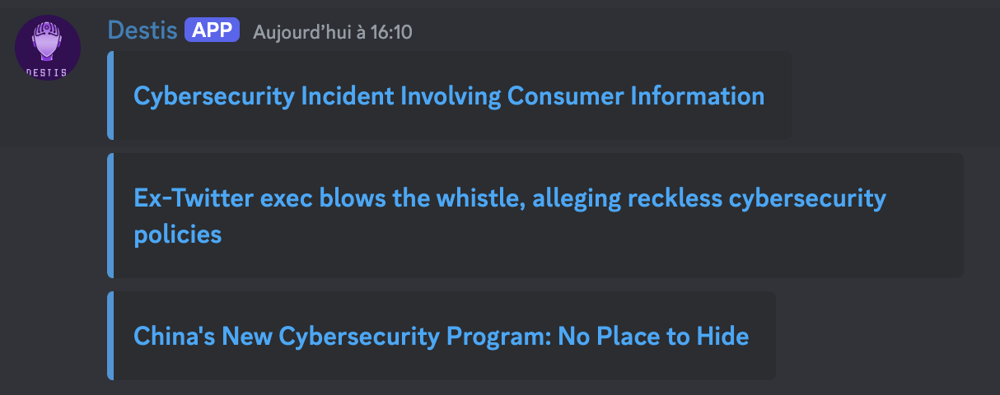
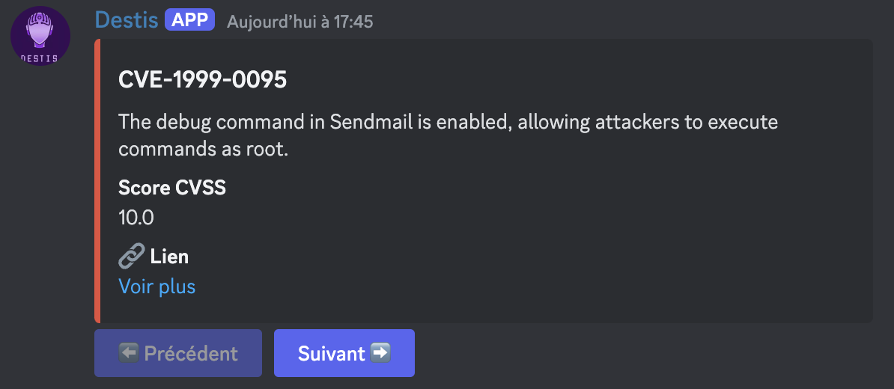
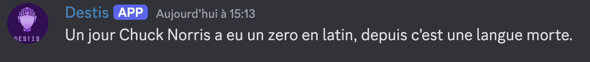

# Bot Discord CVE - Vulnérabilités et Cybersécurité

Un bot Discord conçu pour gérer et afficher des informations sur les CVE (Common Vulnerabilities and Exposures) en temps réel. Ce bot utilise l'API de Discord pour interagir avec les utilisateurs et fournir des informations détaillées sur les vulnérabilités.
Il peut aussi faire des blagues, on peut entièrement les modifier depuis bot/commandes.py

## Fonctionnalités

- **Commande `!cve`** : Affiche une liste de CVE récentes avec des détails spécifiques sur chaque vulnérabilité.
- **Commandes personnalisées** : Ajoute la possibilité d'étendre les fonctionnalités avec de nouvelles commandes.
- **Gestion des variables d'environnement** : Utilisation de `python-dotenv` pour la gestion des clés API et autres informations sensibles.
- **Interface utilisateur** : Utilisation de `discord.py` pour l'affichage des informations dans Discord avec des messages enrichis (embeds).

### Liste des commandes disponibles :

- 🏓 `!ping` - Teste la latence du bot
- 📊 `!status` - Affiche le statut du bot
- ⏰ `!reminder [temps en minutes] [message]` - Définit un rappel
- 🔥 `!vuln` - Affiche les dernières vulnérabilités
- 🎭 `!ajouter_role [membre] [role]` - Ajoute un rôle à un membre
- 🕒 `!time` - Affiche l'heure actuelle
- 🔐 `!news` - Affiche les dernières actualités en cybersécurité
- 🤡 `!blague` - Le bot vous raconte une blague !

## Prérequis

- ✅ Python 3.8 ou plus récent
- ✅ Un bot Discord et un token valide
- ✅ Un environnement virtuel Python (recommandé), il faut bien activer son environnement virtuel et choisir le même interpréteur.
- ✅ Activer le mode Développeur dans Discord :
  - Aller dans **Paramètres** > **Avancés** > **Mode Développeur**
- ✅ Créer une application bot sur **[Discord Developer Portal](https://discord.com/developers/applications)**
  - Générer le **TOKEN** dans l'onglet **Bot**
- ✅ Récupérer l'ID du salon Discord :
  - Clic droit sur le salon → **"Copier l'identifiant du salon"**
- ✅ Ajouter le **TOKEN** et **CHANNEL_ID** dans `.env`

## Configuration du fichier .env

Crée un fichier `.env` à la racine du projet et ajoute :

```ini
TOKEN=VOTRE_TOKEN_DISCORD
CHANNEL_ID=VOTRE_IDENTIFIANT_DU_SALON_DISCORD
```

## Installation

1. Clone ce dépôt sur ta machine locale :
   ```bash
   git clone https://github.com/Yorick-xy/BotDiscordDestis.git
   ```
2. Accède au dossier du projet :
   ```bash
   cd BotDiscordDestis
   ```
3. Installe les dépendances :
   ```bash
   pip install -r requirements.txt
   ```

## Affichage des images

### Aperçu des actualités en cybersécurité



### Aperçu des CVE



### Exemple de blague affichée par le bot


